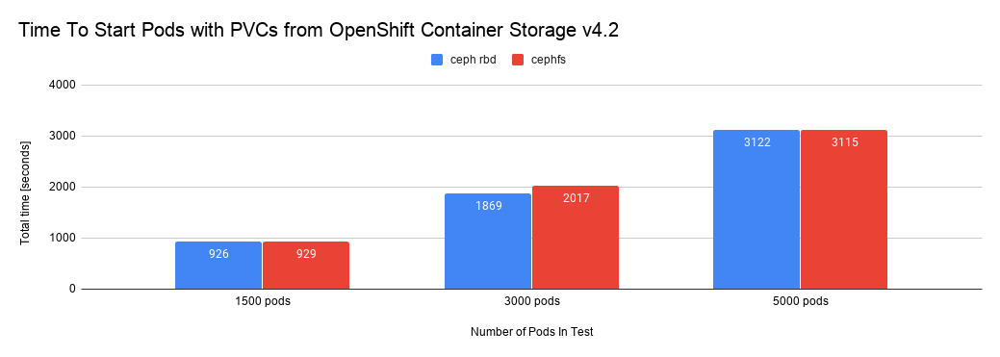
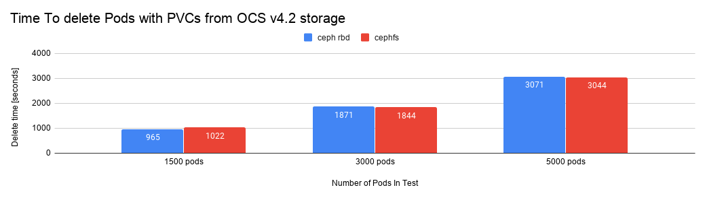
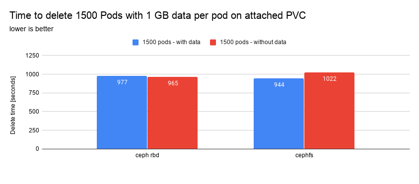
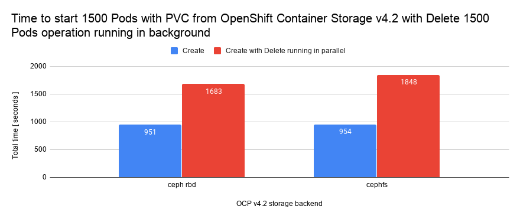

# Scaling Persistent Volume Claims with Red Hat OpenShift Container Storage v4.2 

By Elvir Kuric and Patric Uebele 

## 1. Objective 

For choosing a storage solution for dynamic provisioning of persistent volume claims (PVC) in OpenShift Container Platform, the time it takes to bind and prepare a PVC for the use with application pods is a crucial factor. 

For Red Hat OpenShift Container Storage v4.2 we performed a series of tests  investigating how OCP v4.2 behaves from a scalability point of view.  We wanted to know how fast application pods are starting when PVCs are from different storage classes provided, and to get get numbers which can be used when making decisions when choosing storage solution for OCP application pods.

The test results presented in this document are recommended values for OpenShift Container Storage v4.2 and do not show the real limits for Openshift Container Storage v4.2, which are higher. We will conduct more scalability tests for future OpenShift Container Storage releases. 

For future OpenShift Container Storage releases we plan to target configurations for cases when more pods are running on the OpenShift Container Platform cluster and are actively requesting PVCs originating from Openshift Container Storage.

In this document we describe test processes and results gathered during PVC scale test execution with Openshift Container Storage v4.2 showing why OpenShift Container Storage is the supreme storage solution for use cases where pod density and PVC allocation speed are key, as e.g. in CI/CD environments. 


## 2. Relevance of Scalability Testing? 

When deploying OpenShift Container Platform clusters on public clouds, the cloud providers’ native storage solution can be used to provision storage to application pods running on OpenShift Container Platform platform. Different public cloud providers offer different solutions which attempt to satisfy the needs of OpenShift Container Platform users for storage, but from a scalability point of view most of them have limitations which can be problematic in deployments where the speed of storage allocation is crucial. When native storage classes are source for PVCs used by application pods running in OpenShift Container Platform cluster, there are two limiting factors which prevent users from reaching a higher number of pods with allocated Persistent Volume Claims in a short period of time. 

These limitations imposed on users by public cloud providers can be summarized to below  points: 

- Number of allowed block/volume devices per cloud instance 
- API throttling

Public cloud providers impose limits on maximum number of volumes which can be attached to a cloud instance (in this case an OpenShift Container Platform node) and this limits the maximum number of PVCs which can be allocated to pods on OpenShift Container Platform node to the maximum number of supported volumes by the cloud provider. 

Recommended values for cloud providers might not be exhaustive and can change as maximum number of block devices supported by cloud providers can be updated. For exact values, check the documentation of your cloud provider. 

At the time of this writing various public cloud providers allow you to attach different number of block devices per instance, and the maximum values differ depending on cloud provider and machine type used. Below is a short example of the current situation. 

AWS recommendations are a maximum of [40 volumes]((https://docs.aws.amazon.com/AWSEC2/latest/UserGuide/volume_limits.html#linux-specific-volume-limits)) per instance and going beyond that number can cause problems with machine functionality and is supported on best effort basis.
Many EC2 instances types support a maximum of [28 attachments](https://docs.aws.amazon.com/AWSEC2/latest/UserGuide/volume_limits.html#instance-type-volume-limits) (including network interfaces, EBS volumes, and NVMe instance store volumes) which allows even lower numbers of volumes which can be attached to instance. 

Azure cloud refers to up to [20 volumes](https://docs.microsoft.com/en-us/azure/azure-resource-manager/management/azure-subscription-service-limits2), and GCP offers different options depending on machine type and up to a maximum 120 persistent disks (for custom and predefined machine types - per limits section in [document](https://cloud.google.com/compute/docs/disks/)  per cloud machine. 
 
Another limiting factor when in public cloud is the cloud API rate which dictates how many API requests can be served during a given time period. These values differ from  cloud provider to cloud provider, but in the case of busy OpenShift Container Platform clusters with a  need to issue many API requests in a short period of time (a usual scenarios in high performance/scalability situations) it’s not uncommon that requests can’t be served (requests  ending with errors like “API rate exceeded” ) and requests to allocate volumes for a pod will not be satisfied.

Every request for a volume is at least one API request, often there is another API request to tag volume and if at the same time there a different users issuing volume delete  operations then it will generate additional API requests. Cloud providers allow only a limited number of API requests as specified in their documentation  -  [aws](https://docs.aws.amazon.com/apigateway/latest/developerguide/api-gateway-request-throttling.html), [azure](https://docs.microsoft.com/en-us/azure/azure-resource-manager/management/request-limits-and-throttling), [gcp](https://cloud.google.com/compute/docs/api-rate-limits) - these values can be changed to negotiate special API limits at an additional  and are cloud provider defined.

## 3. OpenShift Container Storage To The Rescue 

When Openshift Container Storage is used as storage provider for application pods in OpenShift Container Platform clusters, the maximum number of volumes per instance is now limited by the linux kernel itself, and these limits are much higher than the limits imposed by cloud providers. 

Also, cloud limitations as API request throttling are not relevant anymore when using OpenShift Container Storage for provisioning persistent storage. In this case when a user sends a request for a new PVC, the API requests live inside the OpenShift Container Platform cluster without the need to interact with the public cloud provider’s API. 

Other benefits like superior performance and the possibility to use the same storage solution across different private/hybrid/public clouds with same API and same management tools do provide better overall experience for end users and easier to maintain Day-2 operations for devops teams. 


## 4. PVC Scale Test Description 

In the PVC Scale tests we test the ability of OpenShift Container Storage to provision a PVC to application pods and measure the time it takes for the pods to be in “Ready” state with the PVC bound to the pod. 

When the PVC is in Bound state it is considered as ready for use by applications. 

Three different configurations for OpenShift Container Storage were covered as described in Table 1. 


**Table 1. Tested configurations during PVC Scale Testing**


| Number of nodes allocated for OpenShift Container Storage cluster | OCP Cluster Size | Number of Tested PVC | RBD - PASS/FAIL | CEPHFS - PASS/FAIL | Numer of pods per OCP Node | 
|-----------------|:-----------:|:----------------:|:----------------:|:------------:|:---------------:| 
|      3          | 12 Worker Nodes, 3 Head / Infra Nodes, 3 Storage Nodes | 1500 | PASS | PASS | 125 |
|      6          | 24 Worker Nodes, 3 Head / Infra Nodes, 6 Storage Nodes | 3000 | PASS | PASS | 125 |
|      9          | 40 Worker Nodes, 3 Head / Infra Nodes, 9 Storage Nodes | 5000 | PASS | PASS | 125 | 

In the above table we specify cluster size parameters, number of tested PVCs and how many nodes were used for that specific test. 


## 5. How Is The Pod Start Time Measured?

When a pod is started it logs various timestamps to OpenShift Container Platform API and for every pod it can be found when it is considered Ready. See an example in the  below stanza from  OCP API **/api/v1/namespaces/namespace/pods**

```
Status.condition
type = Ready 
Status = True 


An example 
 
"conditions": [
                                {
                    "status": "True",
                    "lastProbeTime": null,
                    "type": "Ready",
                    "lastTransitionTime": "2018-12-13T17:27:57Z"
                },
                ]
```

A pod is considered as <em>Ready</em> with attached PVC (PVC in Bound state) when its <em>status</em> is <em>True</em> and <em>type</em> is <em>Ready</em>.

**lastTransitionTime** is the time when the pod moved to this state last time. This is defined in the pod [conditions](https://kubernetes.io/docs/concepts/workloads/pods/pod-lifecycle/#pod-conditions) documentation.  

**Important note:** Pods were not restarted once started, so **lastTransitiontime** was not updated with new value. 

## 6. Test Results 

### 6.1 Create Operation 

For all tested configurations (1500, 3000, 5000 pods/PVCs), it was possible to scale up to the requested number of Pods/PVCs for both storage classes which are part of the OpenShift Container Storage v4.2 setup - ceph rbd / cephfs. During allocation of PVCs for pods, problems with OpenShift Container Storage v4.2 were not encountered in the form of crashing / restarting or similar with OpenShift Container Storage v4.2 pods in the openshift-storage namespace. 


**Graph 1.  Time to start Pods with PVC from OpenShift Container Storage v4.2 storage backend** 



In the graph above we have information showing us how long it takes to start different number of pods with PVCs from the two OpenShift Container Storage  v4.2 storage classes.  From the above graph it is visible that pod’s startup time increases linearly and from the numbers we can conclude that it takes approximately 1.6s to start a pod with attached PVC ( Number of pods / total time ) 

On a 9 node OpenShift Container Storage v4.2 cluster the requirement to scale up to 5000 PVC could easily be satisfied.  


### 6.2 Delete Operation 

Another data point we were interested in was the time that is necessary to remove all volumes at CEPH side after pods/PVCs are removed. For this test we were deleting the project created in 6.1 section and measured the time it took until all volumes were removed at the storage backend side. 

For the case of CEPH RBD we considered that delete was successful if the number of rbd images in example-storagecluster-cephblockpool was zero. Eg. 


```
rbd ls example-storagecluster-cephblockpool | wc -l  
```
In case of CEPHFS we repeated same process and in this case we used 
```
ceph fs subvolume ls example-storagecluster-cephfilesystem csi |grep name | wc -l
``` 
Delete operations worked without problems and the OpenShift Container Platform cluster was fully operational during the whole delete process. 

**Graph 2 - Time necessary to delete pods with empty PVCs**





### 6.2.1 Delete operation with data present on PVCs


It is known that during the delete process there is a difference whether there is data on a PVC or if the PVC is empty. The deletion times may differ for PVCs with data from PVCs without data.
For this test we created 1500 pods with one 2 GB PVC mounted to every pod and afterwards we wrote ( fio --randwrite ) 1 GB file per pod. Once randwrite operation finished ceph df was showing as below 


```
# ceph df
RAW STORAGE:
    CLASS     SIZE        AVAIL       USED        RAW USED     %RAW USED
    ssd       6.0 TiB     1.3 TiB     4.7 TiB      4.7 TiB         78.18
    TOTAL     6.0 TiB     1.3 TiB     4.7 TiB      4.7 TiB         78.18
 
POOLS:
POOL                                                ID    STORED      OBJECTS     USED          %USED    MAX AVAIL
example-storagecluster-cephblockpool                1     1.6 TiB     424.64k     4.7 TiB        82.27   344 GiB
example-storagecluster-cephfilesystem-metadata      2     2.2 KiB     22          384 KiB        0       344 GiB
example-storagecluster-cephfilesystem-data0         3     0 B         0            0 B           0       344 GiB
```
For CEPHFS case <em>ceph df</em> output was as one below 


```
# ceph df        
RAW STORAGE:
    CLASS     SIZE        AVAIL       USED        RAW USED     %RAW USED
    ssd       6.0 TiB     1.6 TiB     4.4 TiB      4.4 TiB         73.53
    TOTAL     6.0 TiB     1.6 TiB     4.4 TiB      4.4 TiB         73.53
 
POOLS:
POOL                                                  ID      STORED      OBJECTS      USED        %USED       MAX AVAIL
example-storagecluster-cephblockpool                  1       393 MiB      25.80k      1.2 GiB      0.09       439 GiB
example-storagecluster-cephfilesystem-metadata        2       258 MiB      3.09k       774 MiB      0.06       439 Gi
example-storagecluster-cephfilesystem-data0           3       1.5 TiB      385.50k     4.4 TiB     77.36       439 GiB
```

From this we can see that the data set we requested during the test was indeed stored at storage backend, and from inside the pods we see [df -h](https://gist.githubusercontent.com/ekuric/5ad4d694995e491b38cb44c17951a1b4/raw/2871541aabfcbeed160af41aa552d0c8e7c917b4/gistfile1.txt) output. 

Below graph shows the time it takes to free up storage space (after deleting the project holding the OpenShift Container Platform pods and PVCs)

**Graph 3 - Time to delete 1500 PVCs with 1 GB data present on every PVC**




As in the test when deleting empty PVC, we monitored the number of volumes in CEPH as indication that they were properly deleted in the storage backend

```
rbd ls example-storagecluster-cephblockpool | wc -l  
```
and for CEPHFS
```
ceph fs subvolume ls example-storagecluster-cephfilesystem csi |grep name | wc -l
```

## 6.3 Concurent create / delete operations

In real life scenarios there will be many  concurrent create / delete operations trying to simultaneously access the same storage resources. This kind of workload is typical for CI/CD pipelines and other modern cloud native applications. A storage layer that can absorb many concurrent create/delete operations in a performant way is therefore crucial for a successful deployment of such applications in OpenShift Container Platform.   

For this purpose we tested a scenario where create pods/PVC operations in one OpenShift Container Platform project were running in parallel with delete operations of OpenShift Container Platform project containing pods/PVCs.
Below graph show the results we got for that test when creating 1500 Pods requesting storage from OpenShift Container Storage v4.2 and at same time dynamically deleting PVC in another OpenShift Container Platform project. 

**Graph 4: Time necessary to start Pods with PVC from OCP v4.2 when running delete PVC operation in parallel with create operation. Comparison with pure creation time (blue bars).**


From the above graph we can see that the time to start 1500 pods with PVC from OpenShift Container Storage v4.2 storage increases if there are concurrent requests occurring at backend and competing for storage resources. Nevertheless the OpenShift Container Storage layer was still answering PVC creation requests in a timely manner without issues like timeouts and could easily cope with the workload.


## 7. Conclusion 

The PVC Scale tests with OpenShift Container Platform / OpenShift Container Storage v4.2 were very stable and confirmed that OpenShift Container Storage v4.2 scales very fast and is able to satisfy very demanding and fast changing CI/CD environments. 

There was not any issue with storage backend during PVC scale process up to the currently recommended 5000 PVC on a 9 node OpenShift Container Storage v4.2 cluster. 
At same time, deletion of Pods with attached PVC from OpenShift Container Platform v4.2 storage ensured that whole process of cleaning storage backend (after PVC were deleted, what triggered PV deletion on OpenShift Container Platform side and RBDs at storage side) was smooth and without issues while doing massive Pods/PVC delete operations. 

The obvious benefit of OpenShift Container Storage v4.2 when it comes to scaling is that  OpenShift Container Storage v4.2 offers a possibility to OpenShift Container Platform users to start more pods per OpenShift Container Platform node for cases where pods are requesting PVCs for operations.

As it is shown in **Table 1.** above we were able to start 125 pods / node with every pod having a PVC attached, and having a total 1500 pods scheduled on 12 OpenShift Container Platform node cluster. This number is much higher than the declared supported values for public cloud providers  (in average 10 times more pods with PVC per node than what public cloud providers offer for the same customer scenario where the requirement is to provide storage (PVC) to many OpenShift Container Platform pods and do that quickly).

In this specific test, using the same cluster it was possible to start 1500 pods on 12 application nodes for the case when OpenShift Container Storage v4.2 was used as storage backend. If customer wants to achieve same pod density in AWS with gp2 storage class as storage provider for application pods, it would not be possible and in order to get the same number of pods it would be necessary to add more machines to OpenShift Container Platform cluster, incurring additional cost. 

If compared with OpenShift Container Storage v3.11, PVC scalability on OpenShift Container Storage v4.2 gives much better results and is more stable in many aspects, especially when it comes to tearing down volumes at storage side after deleting PVCs on the  OpenShift Container Platform side. 

## 8. Future work 

Number of PVC per specific storage configuration per above write up are recommended values for OpenShift Container Storage v4.2 ( OpenShift Container Storage v4.2 ) and not actual limits but for stability we recommend to use them as maximum values for OpenShift Container Storage v4.2. We work to verify other test configuration and results of that work will be provided alongside with future OpenShift Container Storage releases.